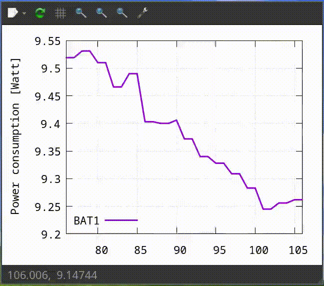

# battery-monitor
A simple script to plot a live graph of laptop power consumption based on
battery reports.

Data is captured via `cat /sys/class/power_supply/BAT*/power_now`.
Multiple-battery setup is suported. In tiling wm setups, it's better to make the
graph window floating, sticky and small.

<p align="center">
  
</p>

Useful for cases when you want to be mindful of what particular situations or
programs increase power consumption. For example in the screencast above, the
laptop was on battery for a while, then we see a power surge which was due to
running a computing-intensive program.

On the tray icon hovering, the tooltip
shows wattage, right-click to quit the script.


## Dependencies
- [feedgnuplot](https://github.com/dkogan/feedgnuplot/) : plots data stream
- libvnlog-perl
- [yad](https://github.com/v1cont/yad) : tray icon

In a Debian-like distro:

```bash
sudo apt install feedgnuplot libvnlog-perl
# yad needs to be built from master, tested with (v14.1)
```

# Usage
Check `battery-monitor -h`:

```console
$ battery-monitor -h
Usage: battery-monitor [-t PERIOD] [-w WIDTH] [-V] [-h]
DESCRIPTION
    Plot power consumption [Watt] of batteries

OPTIONS
    [-t PERIOD] :
        Sampling period in seconds
        Default: 1
    [-w WIDTH] :
        Graph window width in seconds
        Default: 30
    [-V] :
        Print version
    [-h] :
        Display the help message

EXAMPLES
    # graph power consumption wattage for sampling period of 0.5 seconds and
    # window of 4 seconds
    battery-monitor -t 0.5 -w 4
```

# Development
- linter: `shellcheck`
- formatter: `shfmt -i 4 -bn -ci -sr`
